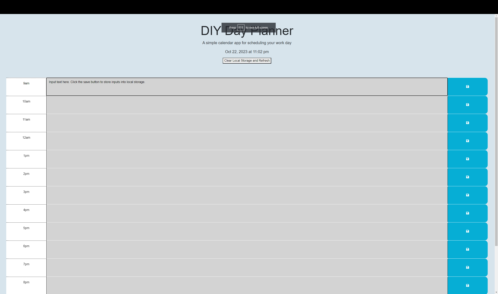

# DIY Day Planner

## Description

This is a day schedule maker which is broken down into hour long blocks. The goal is to be able to utilize this calender to plan out your day. In order to build this, it is necessary to use local storage to to both log and recall the information entered into their respective hour long slots, even between page reloads.

## Installation

n/a

## Usage

To utilize the calender app, simply input information into the text area following the various hour indicators. Once the text field displays the desires information, click the "save" icon to the far right of the page. This stores the information in local storage which, until manually cleared, shall persist though various page reloads. When you want to clear the page, simply click the "clear and refresh" button on the top of the page.

## Credits

# Collaborators

UCONN Coding Bootcamp Student - Nicole Choiniere-Kroeker (nchoin)

UCONN Coding Bootcamp Tutor - Ramon Sanchez

# Links to online resources

ChatGPT 3.5 - https://www.chat.openai.com/

W3Schools - https://www.w3schools.com/

DayJS - https://cdn.jsdelivr.net/npm/dayjs@1.11.3/dayjs.min.js

JQuery - https://cdnjs.cloudflare.com/ajax/libs/jquery/3.2.1/jquery.min.js

Bootstrap - https://cdn.jsdelivr.net/npm/bootstrap@5.1.3/dist/css/bootstrap.min.css

Font Awesome - https://use.fontawesome.com/releases/v5.8.1/css/all.css

Google Fonts - https://fonts.googleapis.com/css2?family=Fira+Sans:wght@400;700&display=swap

## License

MIT License. See project repo for more information concerning the license.

----